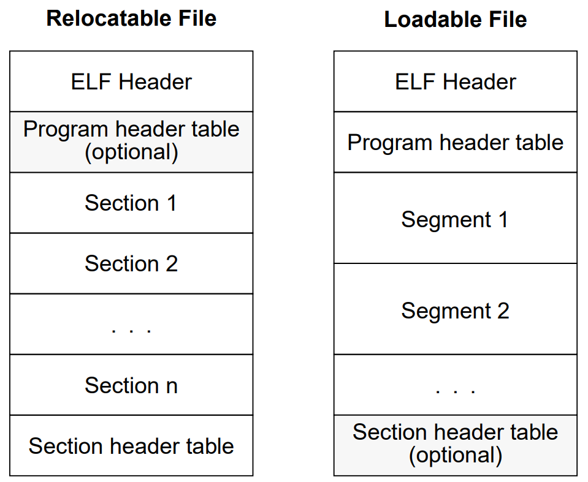

# ReadELF : Program Header Table

## 1 思路



前面的实验成功读取了ELF Header的部分，在本实验，实现读取Program header table，其实方法类似，只不过这个table里面包含了多个entry，而我们只取读type为LOAD的entry，其余的先不考虑。

## 2 实现

同样的，先用readelf工具来获取Program header table的内容：

```txt
Program Headers:
  Type           Offset             VirtAddr           PhysAddr
                 FileSiz            MemSiz              Flags  Align
  PHDR           0x0000000000000040 0x0000000000000040 0x0000000000000040
                 0x0000000000000230 0x0000000000000230  R      0x8
  INTERP         0x0000000000000270 0x0000000000000270 0x0000000000000270
                 0x0000000000000021 0x0000000000000021  R      0x1
      [Requesting program interpreter: /lib/ld-linux-riscv64-lp64d.so.1]
  RISCV_ATTRIBUT 0x0000000000001033 0x0000000000000000 0x0000000000000000
                 0x0000000000000053 0x0000000000000000  R      0x1
  LOAD           0x0000000000000000 0x0000000000000000 0x0000000000000000
                 0x000000000000074c 0x000000000000074c  R E    0x1000
  LOAD           0x0000000000000db0 0x0000000000001db0 0x0000000000001db0
                 0x0000000000000258 0x0000000000000260  RW     0x1000
  DYNAMIC        0x0000000000000dc8 0x0000000000001dc8 0x0000000000001dc8
                 0x00000000000001f0 0x00000000000001f0  RW     0x8
  NOTE           0x0000000000000294 0x0000000000000294 0x0000000000000294
                 0x0000000000000044 0x0000000000000044  R      0x4
  GNU_EH_FRAME   0x00000000000006d8 0x00000000000006d8 0x00000000000006d8
                 0x000000000000001c 0x000000000000001c  R      0x4
  GNU_STACK      0x0000000000000000 0x0000000000000000 0x0000000000000000
                 0x0000000000000000 0x0000000000000000  RW     0x10
  GNU_RELRO      0x0000000000000db0 0x0000000000001db0 0x0000000000001db0
                 0x0000000000000250 0x0000000000000250  R      0x1
```

我们只关心Type为LOAD的Entry，这里有两个，第一个的Flags为RE，第二个的Flags为RW，前者为可执行可读代码，后者为可读可写数据。

后者的MemSiz比FileSize大是因为有些bss，即未初始化的数据。

可以看到虚拟地址和物理地址是一样的，而其实物理地址在此时是无意义的。

### 2-1 数据结构

同样根据手册中的定义，来定义Program Header Entry的结构：

```c
typedef struct
{
    Elf64_Word p_type;
    Elf64_Word p_flags;
    Elf64_Off p_offset;
    Elf64_Addr p_vaddr;
    Elf64_Addr p_paddr;
    Elf64_Xword p_filesz;
    Elf64_Xword p_memsz;
    Elf64_Xword p_align;
} Elf64_Phdr_t;
```

### 2-2 读取

在ELF Header中记录了Program Header Table的Offset和Num，即偏移量和Entry数量，当然也记录了每个Entry的大小。故而就可以借助这些数据来读取每个Entry的内容了。

```c
void debug_readElf(char *program)
{
    int fd = open(program, O_RDONLY);
    if (fd == -1)
        MYEXIT("open fail");
    FILE *file = fdopen(fd, "rb");

    // for Elf Header
    uint8_t buffer_ElfHeader[sizeof(Elf64_Ehdr_t)];
    if (fread(buffer_ElfHeader, 1, sizeof(Elf64_Ehdr_t), file) != sizeof(Elf64_Ehdr_t))
    {
        printf("fread fail\n");
    }
    print_ElfHeader((Elf64_Ehdr_t *)buffer_ElfHeader);
    Elf64_Ehdr_t elf64_ehdr = *(Elf64_Ehdr_t *)buffer_ElfHeader;

    // for Program Header Table
    uint8_t buffer_ProgramHeaderTableEntry[elf64_ehdr.e_phentsize];
    for (int i = 0; i < elf64_ehdr.e_phnum; i++)
    {
        readElf_PHTE((Elf64_Ehdr_t *)buffer_ElfHeader, (Elf64_Phdr_t *)buffer_ProgramHeaderTableEntry, i, file);
        Elf64_Phdr_t elf64_phdr = *(Elf64_Phdr_t *)buffer_ProgramHeaderTableEntry;
        if (elf64_phdr.p_type == PT_LOAD)
            print_ElfProgramHeaderTableEnrty((Elf64_Phdr_t *)buffer_ProgramHeaderTableEntry);
    }
}
```

运行后可以得到：

```txt
***Elf Program Header Table Entry***
Type        :  1
Offset      :  0
FileSize    :  74c
VirtAddr    :  0
MemSize     :  74c
PhysAddr    :  0
Flags       :  5
Align       :  1000
***Elf Program Header Table Entry***
Type        :  1
Offset      :  db0
FileSize    :  258
VirtAddr    :  1db0
MemSize     :  260
PhysAddr    :  1db0
Flags       :  6
Align       :  1000
```

> paddr一般无意义，offset和filesz指的是当前elf文件中的信息，vaddr和memsz指的是当程序加载到内存中时的信息，memsz会比filesz大的原因是：在elf文件中，未被初始化的数据会放在bss端，但当程序被加载到内存中时，这些未被初始化的数据会被填充为0。
