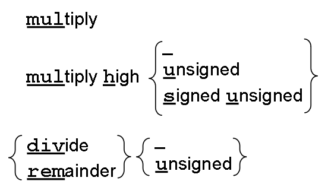
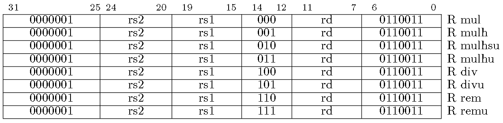

# RV32M

## 0. 指令总览

乘法得低位，乘法得高位；除法得商，除法得余数

## 1. 汇编和机器码的对应图

* mul：获取积的低32位
* mulh：获取积的高32位(两个操作数均为有符号数)
* mulhu：获取积的高32位(两个操作数均为无符号数)
* mulhsu：获取积的高32位(一个有符号一个无符号)
* div：有符号整数除法
* divu：无符号整数除法
* rem：求有符号余数
* remu：求无符号余数
