# "B" Extension for Bit Manipulation, Version 1.0.0

[&#34;B&#34; Extension for Bit Manipulation, Version 1.0.0](B Extension.pdf)

## 1 Zb*

RISC-V的B扩展（Bit Manipulation Extension）是一组用于位操作的指令集扩展，旨在提供代码大小优化、性能提升和能耗降低。B扩展由多个子扩展（Zba、Zbb、Zbs等）组成，每个子扩展专注于特定类型的位操作。B扩展适用于RV32和RV64架构。

子扩展有：

* Address generation instructions
* Basic bit-manipulation
* Carry-less multiplication
* Single-bit instructions

## 2 Zba : Address generation

Zba用于加速地址生成，比如数组索引计算(优化内存访问中的地址计算，如 `array[i]`的地址计算)。

其包含的指令如下：

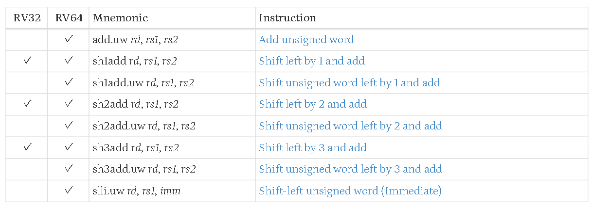

## 3 Zbb : Basic bit-manipulation

### 3-1 Logical with negate

与非、或非和异或非：

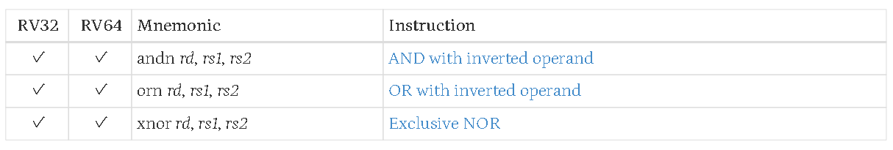

### 3-2 Count leading/trailing zero bits

前导零计数和尾随零技术：

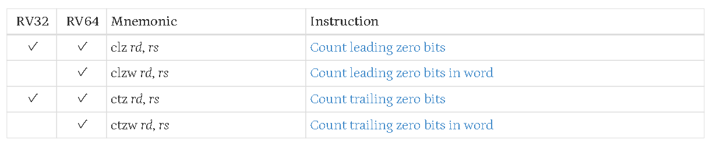

### 3-3 Count population

置1位数统计：

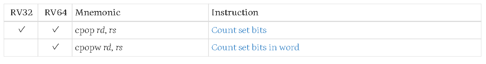

### 3-4 Integer minimum/maximum

返回两个数中较小/较大的那个数

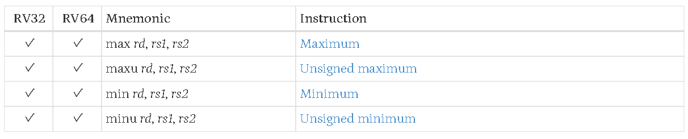

### 3-5 Sign extension and zero extension

实现符号扩展和零扩展，替代了：

* 对于8-bit/16-bit的符号扩展：slli rd,rs,(XLEN-`<size>`) + srai
* 对于16-bit的零扩展：slli + srli

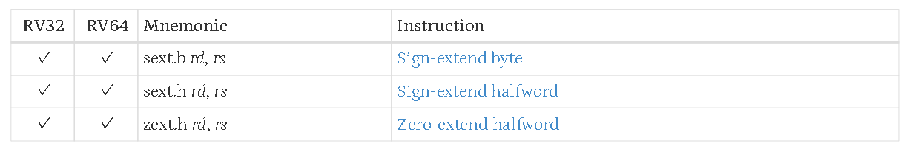

### 3-6 Bitwise rotation

循环移位(circular shifts)，左/右旋转和立即数右旋：

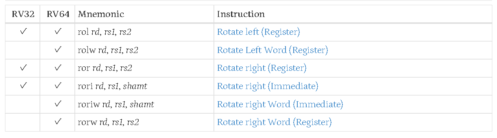

### 3-7 OR Combine

按字节或合并，可用于优化strlen和strcpy等字符串处理函数：

bitwise:逐位/按位，granule:颗粒

### 3-8 Byte-reverse

字节反转：

## 4 Zbc : Carry-less multiplication

支持无进位乘法，其中clmulr反转无进位乘法可用于CRC加速：

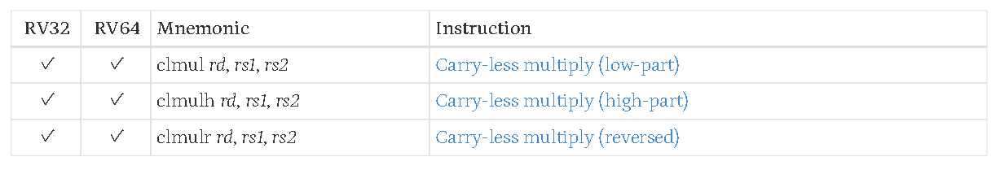

应用场景: CRC, AES-GCM, ECC

## 5 Zbs : Single-bit instructions

对寄存器中的单个位进行设置、清楚、翻转或提取：

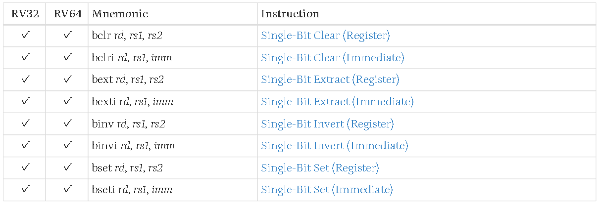

## 6 Zbkb : Bit-manipulation for Cryptography

为加密算法提供专用位操作：

* 复用Zbb扩展的rol/ror, andn/orn/xnor, rev8等指令；
* 新增pack/packh/packw(打包寄存器低半部分)；
* brev8(字节内比特反转)、zip/unzip(比特交织/解交织，仅RV32)。

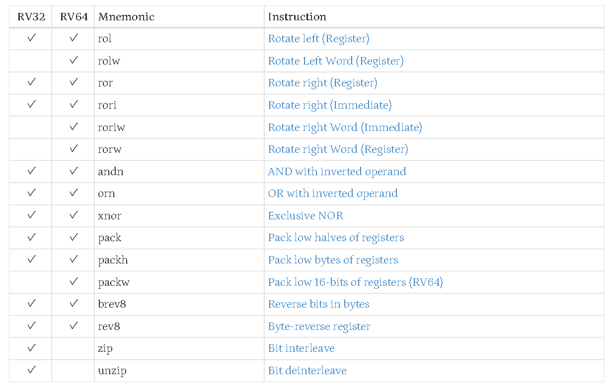

## 7 Zbkc : Carry-less multiplication for Cryptography

精简版Zbc，仅包含clmul和clmulh，专为GHASH(AES-GCM)优化：

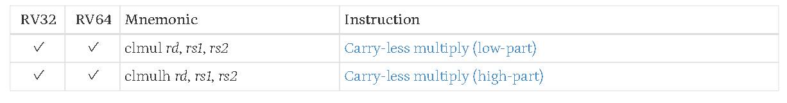

## 8 Zbkx : Crossbar permutations

实现跨字节/半字节的查找表操作，用于加密中的S盒替换：

## 9 优化案例

strlen（字符串长度计算）

* 关键指令：`orc.b`+ `ctz`/`clz`。
* 原理：

  * •`orc.b`将每个字节按位或合并，若某字节为0（NUL），则结果对应字节为0xff。
  * 通过 `not`和 `ctz`（小端）或 `clz`（大端）快速定位第一个NUL字节的位置。
* 优势：减少循环次数，利用XLEN位宽并行处理多个字节。

strcmp（字符串比较）

* 关键指令：`orc.b`+ `rev8`（大端时）。
* 原理：

  * 对齐内存时，使用 `orc.b`检测NUL字节，结合 `rev8`处理大端序。
  * 若未对齐，回退到逐字节比较。
* 优势：对齐情况下通过寄存器级比较大幅加速。
