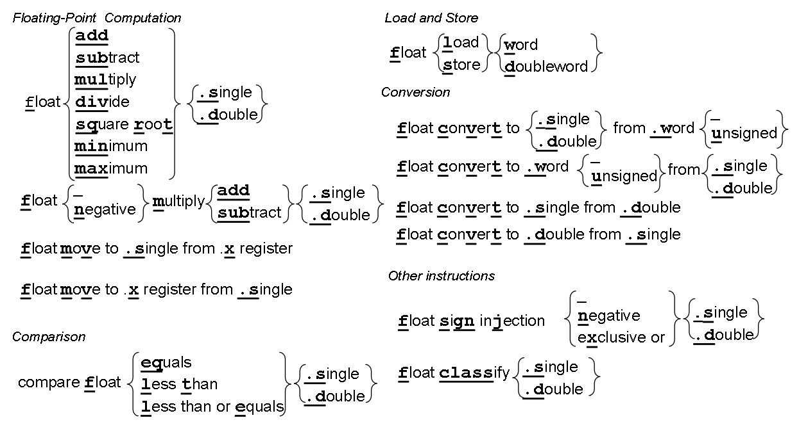
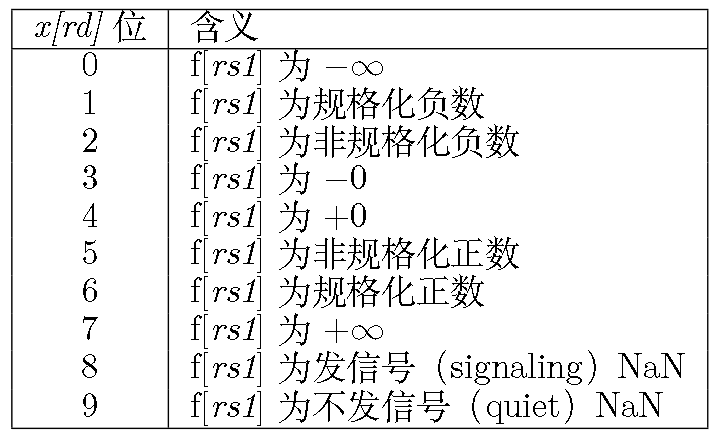

# RV32F and RV32D

[RV32](image/05_RV32FandRV32D/RV32F-all.png)F和[RV32D](image/05_RV32FandRV32D/RV32D-all.png)的汇编-机器码对应图

## 0. 指令总览

* 浮点计算：加、减、乘、除、平方根、最小值、最大值(single和double两个版)，f register<->x register，乘后加减/负乘后加减
* 存数和取数：字和双字版
* 比较：等于、小于、小于等于(single和double两个版)
* 转换：I->F/I->D、F->I/D->I、F->D/D->F，即I、F、D三者之间的两两双向互转，包括有符号和无符号I，共10条
* 其他：分类和符号位

> 汇编指令全是f开头；转换指令都是fcvt..(s->single,d->double,w->word,wu->word unsigned)；存取数指令是word和doubleword；RV32F的存取数指令第12位为0，RV32D为1；RV32F的其他指令第25位为0，RV32D为1

## 1. 浮点寄存器

32个[f寄存器](image/05_RV32FandRV32D/RV32F-Register.png)

> **为啥不用x寄存器存浮点数？**因为这样会增加指令格式中寄存器字段的长度
>
> **增加一组f寄存器对于指令集有什么影响？**需要增加f寄存器和内存之间、f寄存器和x寄存器之间的数据传输指令
>
> **RV32F和RV32D对于f寄存器的使用有什么区别？**RV32F使用单精度数据，故只用f寄存器的低32位
>
> **f寄存器和x寄存器在ABI上的主要区别？**f寄存器没有硬连线0，且只有s、a、t三类

浮点算数的[舍入模式](image/05_RV32FandRV32D/RoundingMode.png)

## 2. 浮点计算、比较、存取数

浮点计算：四则运算、求平方根、取最小值和最大值、先将两个操作数相乘然后将乘积或对乘积取负后加上或减去第三个操作数最后将结果写入目的寄存器**[R4-type]**

比较：等于feq、小于flt、小于等于fle；会把比较结果写入x寄存器；可以结合RV32I中的branch指令来实现条件分支

存取数：flw、fsw、fld、fsd

## 3. 浮点转换和数据传送

浮点转换fcvt：s、d、w、wu四个之间的转换，不包括w和wu之间的转换

数据传送fmv：支持x寄存器和f寄存器之间的直接数据传送 **fmv.x.w fmv.w.x**

## 4. 其他指令

### 4.1 符号注入指令

**复制并操作符号位：**

* 浮点符号注入(fsgnj.s,fsgnj.d)：结果的符号位为rs2的符号位
* 浮点符号取反注入(fsgnjn.s,fsgnjn.d)：结果的符号位与rs2的符号位相反
* 浮点符号异或注入(fsgnjx.s,fsgnjx.d)：结果的符号位是rs1和rs2的符号位的异或

**伪指令：**

复制fmv、取反fneg、取绝对值fabs分别对应fsgnj、fsgnjn、fsgnjx

### 4.2 分类指令

**对浮点数据分类：**

fclass检查源操作数rs1(f寄存器)满足下面10种浮点数属性的哪一种，将结果写入目的操作数rd(x寄存器)的低10位

10位种仅有1位为1，其余位为0

