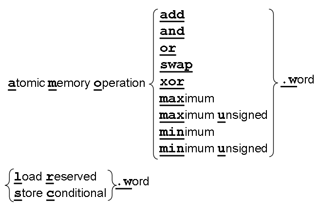
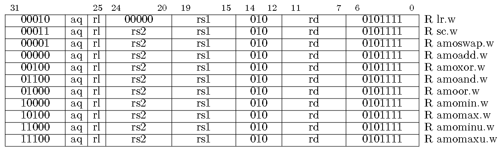

# RV32A

## 0. 指令总览

原子内存操作：第25、26位分别代表acquire和release，获取位和释放位，用于实现临界区

预订取数/条件存数：读出一个内存字(rs1)，写入目的寄存器，记录该内存字的预订信息/往源寄存器(rs1)中的地址写入一个字(rs2)，前提是该目标地址被预订，成功则向目的寄存器写0，否则写非0

## 1. 汇编和机器码的对应图

全是R-type

## 2. 两个实例

用lr和sc实现[比较-交换操作](image/06_RV32A/lr-sc.png)：比较某寄存器值(a1)与用另一寄存器(a0)寻址的内存值，若相等，则将第 3 个寄存器(a2)的值与内存值交换

用amo实现[保护临界区](image/06_RV32A/amo.png)：利用amoswap.w.aq amoswap.w.rl实现临界区
