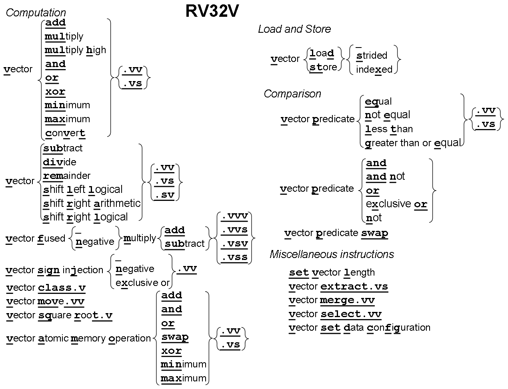
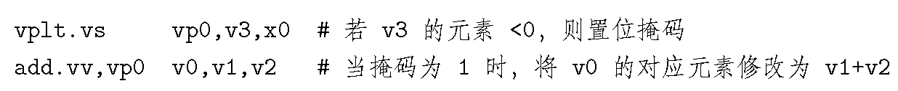

# RV32V

> 向量计算机从内存中**聚集**读出数据并将其放入向量寄存器中，**执行单元**会在向量寄存器上高效计算，然后将计算结果从向量寄存器**分散**写会内存中
>
> 注：索引取数(vldx)和存数(vstx)通常称为聚集(gather)和分散(scatter)；执行单元是处理器中的硬件模块，负责执行指令集架构中定义的各种操作

## 0. 向量寄存器、动态类型、并行度

> **啥是动态类型？**向量计算指令所操作的数据的类型和位宽是动态变化的
>
> **如何实现数据的类型和位宽动态变化？**vsetdcfg指令可以设置向量寄存器类型(数据类型+位宽)，见[图](image/08_RV32V/vetype.png)
>
> **向量寄存器和x/f寄存器有啥不一样？**1个x/f寄存器就是存了1个数，1个向量寄存器存的数有vl个
>
> **向量操作的并行度怎么衡量？**每个时钟周期计算多少位的操作+每个向量寄存器元素多少个

* **向量寄存器共有32个，每个寄存器的元素数量由操作位宽和向量寄存器堆大小决定。**比如，处理器为向量寄存器堆分配 4096 字节(byte)，则可以将32个向量寄存器分别划分为16个操作位宽为64的元素、或32个操作位宽为32的元素、或64个操作位宽为16的元素、或128个操作位宽为8的元素
* **mvl：最大向量长度。**比如，只启用两个类型为64位浮点数的向量寄存器，向量寄存器堆大小为1024字节，则处理器将为每个寄存器分配512字节，所以每个寄存器有64个元素，此时，处理器会将mvl动态设置为64，该值仅由处理器设置，软件不能修改
* **vl：向量长度寄存器。**设置指定操作的向量元素数量

## 1. 计算指令

* 两个操作数
  * 对称
    加、乘、与、或、异或、最大、最小、转换；两个源操作数均为向量(.vv)；一个为向量另一个为标量(.vs)
  * 非对称
    减、除、余、移位操作；两个源操作数均为向量(.vv)；第一个为向量，第二个为标量(.vs)；第一个为标量，第二个为向量(.sv)
* 三个操作数
  融合乘加操作；.vvv, .vvs, .vsv, .vss

注：在执行指令之前，需要先在向量寄存器中设置数据类型和位宽

## 2. 存取指令

一维数组：处理顺序存放在内存的一维数组；取数通过vld指令提供的起始地址，将内存地址连续的数据读入向量寄存器；向量寄存器关联的数据类型决定数据大小、向量长度寄存器vl决定需要读出的数据元素数量；vld/vst

多维数组：行优先/列优先方式存放；两个源寄存器，提供起始地址和步长(字节)；vlds/vsts

稀疏数组：两个源寄存器，一个向量寄存器，一个标量寄存器，提供稀疏数组中非零元素的字节索引和稀疏数组的起始地址；

## 3. 条件指令

* 条件指令都是谓词(predicate)指令
* 谓词指令的目的寄存器是向量谓词寄存器(vp*i*)——条件成立，掩码向量(向量谓词寄存器)中的相应元素写1，否则写0；共8个vp*i*
* vp0或vp1作为控制向量操作的掩码
* 掩码用来禁止一个向量寄存器中部分元素的向量操作——掩码向量的第i个元素为1表示向量操作会修改元素i，否则元素保持不变

例子：

## 4. 其他指令

setvl：将向量长度寄存器(vl)和目的寄存器设为源操作数和最大向量长度(mvl)的较小值

vselect：vselect v0, v1, v2 若v2的前四个元素为2 0 4 8，则该指令将用v1的第2个元素写入v0的第0个元素，用v1的第0个元素写入v0的第1个元素，用v1的第4个元素写入v0的第2个元素，用v1的第8个元素写入v0的第3个元素

vmerge：vmerge, vp0 vdest, vsrc1, vsrc2 若vp0的前四个元素为0 0 1 1，vsrc1的前四个元素为1 2 3 4，vsrc2的前四个元素为5 6 7 8，则该指令执行后，vdest的前四个元素为1 2 6 7

vextract：vextract v0, v1, a0 若vl为128，a0为32，则指令执行后，v0的第1个元素到第96个元素是v1的第33个元素到第128个元素
