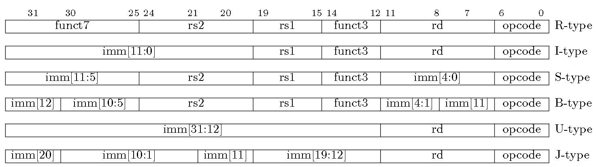
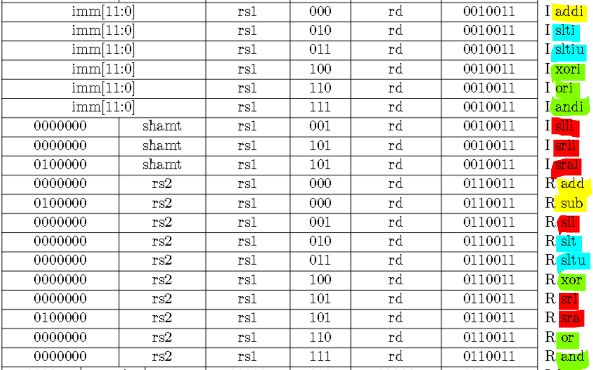
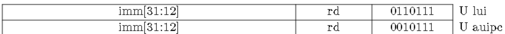
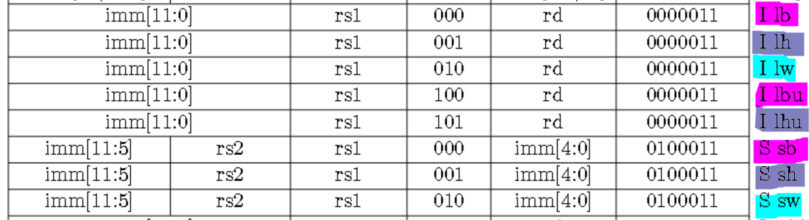
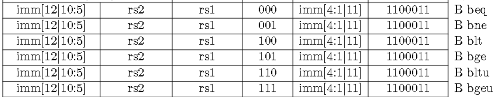
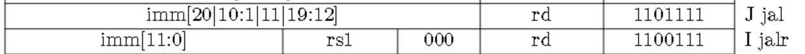
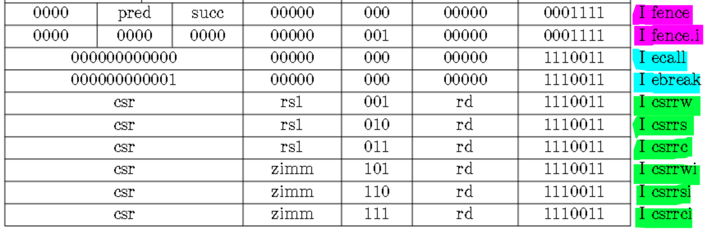

# RV32I

[汇编-机器码的对应图](image/02_RV32I/RV32I-all.png)

## 0. 指令总览

整数计算、控制转移、取数和存数、其他

## 1. 指令类型

* R-type：用于寄存器间(**R**egister)操作
* I-type：用于短立即数(**I**mmediate)和取数操作
* S-type：用于存数(**S**tore)操作
* B-type：用于条件(**B**ranch)分支
* U-type：用于长(**U**pper)立即数
* J-type：用于无条件(**J**ump)跳转

特点：只有6种指令格式，每种都是32位，简化了指令译码过程；支持3个寄存器操作数；源寄存器、目的寄存器位于同一字段；全为0/1的指令为非法指令；

> S-type和B-type的区别在于立即数字段之间的旋转；U-type和J-type的区别同理

## 2. 寄存器

RV32I共有x0-x31共32个寄存器，每一个寄存器都有一个ABI的名称，其中x0硬连线为0，PC寄存器为单独的一个寄存器。

详见图[寄存器](image/02_RV32I/RV32I-Register.png)

## 3. 整数计算

主要分为简单算术指令(yellow)、逻辑运算指令(green)、移位指令(red)和其他

slt、sltu、slti、sltiu、lui、auipc

**RV32I 可通过立即数字段为 0 的 auipc 获取当前 PC**

## 4. 取数和存数

lw、sw；lb、lbu、sb；lh、lhu、sh

## 5. 控制转移

### 5.1 条件分支

beq、bne、bge、blt、bgeu、bltu

### 5.2 无条件跳转

jal、jalr

巧妙把rd设为x0/zero

## 6. 其他指令

其他类型指令均为I-type

*csr指令用于访问程序性能计数器；ecall/ebreak与environment有关；fence与I/O、访存定序有关 fence.i用于同步指令和数据流（这块还不太懂）*

