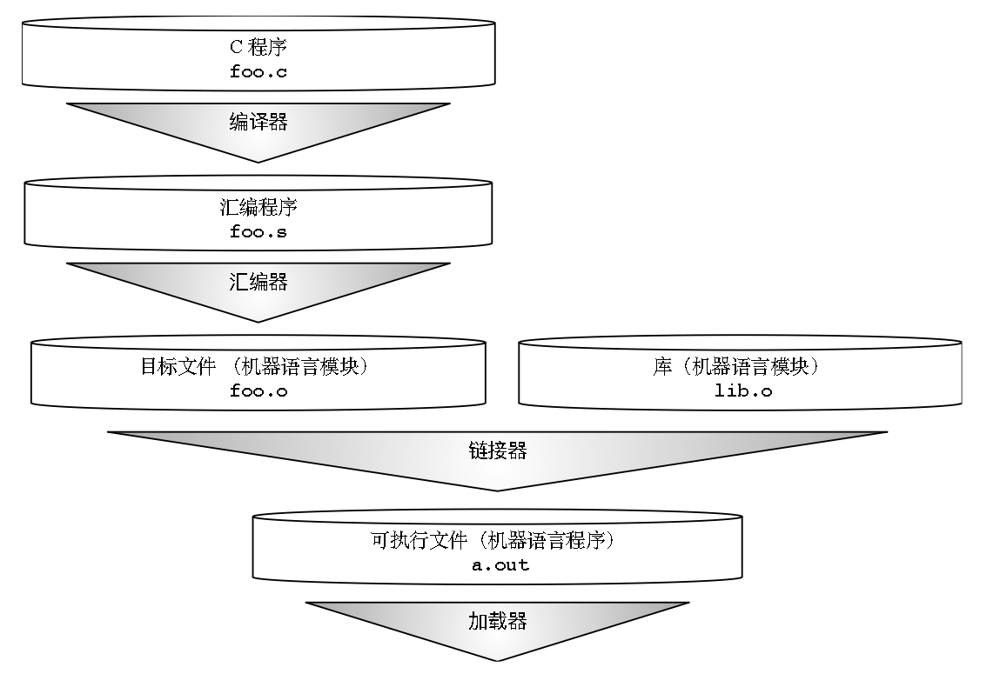

# .c->.s->.o->.out

## 0. C语言程序->可运行的机器语言程序

从C语言程序到可运行的机器语言程序需要四步，即编译器将.c文件编译为.s文件，汇编器将.s文件汇编为.o文件，连接器将同为机器语言模块的目标文件和库文件链接为.out文件，最后加载器运行机器语言程序，即可执行文件。

## 1. 保存寄存器/临时寄存器

在函数调用前后值不会发生改变的是保存寄存器，如s、sp等；值可能改变的叫临时寄存器，包括t、a、ra等

## 2. 汇编器

### 2.1 伪指令

汇编器不仅支持处理器可以理解的汇编指令，还支持方便汇编语言程序员和编译器开发者的伪指令

主要分为[依赖于零寄存器x0](image/03_c-s-o-out/pseudoinstructions-x0yes.png)和[与零寄存器x0无关](image/03_c-s-o-out/pseudoinstructions-x0no.png)的伪指令两类，它们分别是32条和28条

### 2.2 汇编器指示符

[assembler directives](image/03_c-s-o-out/assembler-directives.png)

以英文句号开头的命令

通知汇编器在何处放置代码(.text)和数据(.data)、指定程序中使用的代码和数据常量等

### 2.3 ELF

**E**xectuable and **L**inkable **F**ormat

汇编器将.s文件汇编生成ELF(可执行可链接格式)标准格式目标.o文件，例如[插入排序](image/03_c-s-o-out/insert_sort.png)

## 3. 链接器

link editor

调整所有目标文件中指令的程序地址和数据地址；确定目标文件中符号表的数据符号和代码符号

RV32的ABI有ilp32、ilp32f、ilp32d

**静态链接&动态链接：**

* static linking——在程序运行前，链接并加载所有库的代码->如果库很大，把一个常用库链接到多个程序浪费内存空间；库代码有变动，需要重新链接
* dynamic linking——首次调用外部函数时，链接并加载到程序中，后续调用采用fast linking(快速链接)->如果多个程序使用同一个库，库代码在内存中只有一份；动态链接最新的/当前版本的库

## 4. 加载器

.out文件存储在存储设备中

当运行一个.out程序时，加载器将其从存储设备加载到内存中，并跳转到它的起始地址

如果是动态链接，加载器会先启动动态链接器，然后动态链接器会启动程序，之后负责处理首次外部函数的调用，即将函数复制到内存

> 如今，加载器往往是os
