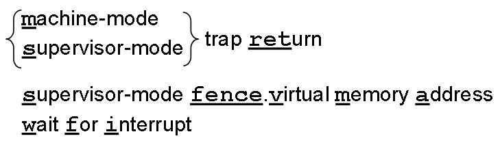
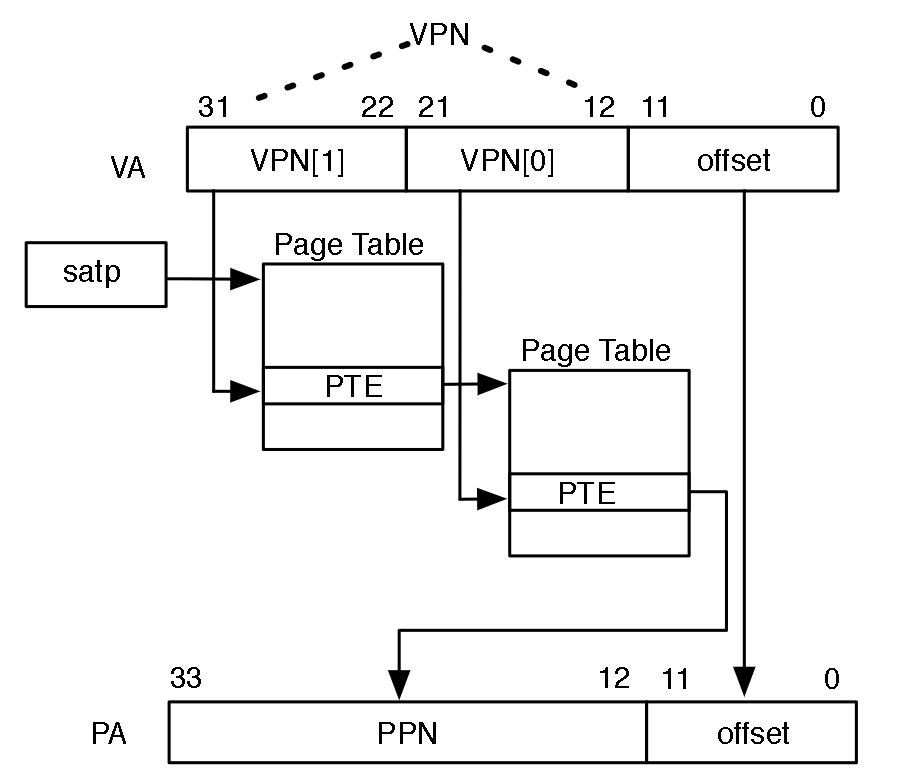

# Privileged Mode

> 之前提到的指令都能在**用户模式(User Mode)**下执行，除此之外，还有**机器模式(Machine Mode)**和**监管模式(Supervisor Mode)**
>
> 高特权模式不仅能访问低特权模式的功能，而且具备低特权模式不可用的**额外功能**
>
> 额外功能具象化为**特权指令**和**CSR寄存器**

## 0. 特权指令与CSR寄存器

指令布局可见[图](image/10_PrivilegedMode/privileged-all.png)

CSR寄存器：[m/s]status、[m/s]scratch、[m/s]ip、[m/s]ie、[m/s]tval、[m/s]tvec、[m/s]cause、[m/s]epc

## 1. 机器模式

机器模式的最重要特性就是**拦截和处理异常**

* 异常的分类
  * 同步异常——指令执行的一种结果
    * 访问故障异常：物理内存地址不支持访问类型，如尝试写入ROM
    * 断点异常：执行ebreak指令，地址或数据与调试触发器匹配
    * 环境调用异常：执行ecall指令
    * 非法指令异常：对无效操作码进行译码；U模式访问M模式CSR寄存器等
    * 不对齐地址异常：有效地址不能被访问位宽整除
  * 中断——与指令流异步的外部事件
    * 软件：通过写入一个内存映射寄存器触发，用于一个硬件线程通知另一个
    * 时钟：实时计数器(mtime)大于等于硬件线程的时间比较器(mtimecmp)时触发
    * 外部：由连接了外部设备的中断信号的平台级中断控制器触发
* 异常的处理
  * 需要用到8个CSR
    * [mstatus](image/10_PrivilegedMode/mstatus.png)：维护各种状态，如全局中断使能MIE、MPIE
    * [mscratch](image/10_PrivilegedMode/mtval&mepc&mscratch.png)：向异常处理程序提供一个空闲可用的寄存器
    * [mtval](image/10_PrivilegedMode/mtval&mepc&mscratch.png)：存放与当前自陷相关的辅助信息
    * [mtvec](image/10_PrivilegedMode/mtvec.png)：存放发生异常时处理器跳转的地址(Base or Base+(4*cause))
    * [mcause](image/10_PrivilegedMode/mcause.png)：指示发生了何种异常(是不是中断 触发自陷的[事件指示码](image/10_PrivilegedMode/mcause-Interrupt_ExceptionCode.png))
    * [mepc](image/10_PrivilegedMode/mtval&mepc&mscratch.png)：指向发生异常的指令
    * [mip](image/10_PrivilegedMode/mip&mie.png)：记录当前的中断请求
    * [mie](image/10_PrivilegedMode/mip&mie.png)：维护处理器的中断使能状态
  * 处理异常(前4步为原子性)
    * 异常指令PC保存到mepc，PC设为mtvec
    * 异常原因写入mcause，辅助信息写入mtval
    * mstatus.MIE清零以屏蔽中断，MIE旧值保存在MPIE
    * 异常发生前的模式保存在mstatus.MPP，模式更改为M
    * mscratch用来避免覆盖整数寄存器内容
    * 异常处理程序的执行
    * mscratch的恢复
    * mret(前4步的逆过程)

> M-mode的指令：mret&wfi(告知处理器目前无实质性工作，故它进入低功耗模式，直到任意使能的中断到来，即mie&mip!=0)
>
> wfi与mstatus.MIE无关

**!!!!!!!重点理解[时钟中断处理程序](image/10_PrivilegedMode/ClockInterruptHandler.png)**

## 2. 用户模式

**为什么需要用户模式？**

* 在M模式下运行的硬件线程能**完全访问内存、I/O和底层系统功能**
* 部分应用程序代码**不可信**
* 需要用户模式来限制应用程序使用**高级别特权指令**及**高级别CSR寄存器**，否则抛出非法指令异常
* **访问内存的限制**由PMP(Physical Memory Protection)实现，M模式指定哪些地址可以让U模式访问
* **PMP实现方式**：地址寄存器[pmpaddr](image/10_PrivilegedMode/pmpaddr&pmpcfg.png)+配置寄存器[pmpcfg](image/10_PrivilegedMode/pmpaddr&pmpcfg.png)(用于配置读、写和执行权限)

> 当处于U模式的处理器尝试取指或访存时，其地址会和所有 PMP 地址寄存器比较。若地址大于等于第 i 个 PMP 地址寄存器，但小于第i+1个PMP地址寄存器，则让第i+1个PMP配置寄存器决定是否允许该访问，若否，则抛出一个访问故障异常
>
> pmpcfg中R、W、X字段分别表示读(取数)、写(存数)和执行(取指)权限；A字段用于表示是否启用PMP，1表示启用
>
> pmpaddr和pmpcfg均为CSR寄存器

## 3. 监管模式

**为什么需要监管模式？**

* PMP有缺点
  * PMP支持的内存区域数量固定，无法扩展到更复杂的应用场景
  * 支持的内存区域在物理内存中必须连续，可能使系统产生内存碎片问题
  * 不能有效支持外存的分页
* 页式虚拟内存解决PMP的缺点
* S-Mode旨在支持现代类Unix操作系统，如Linux、FreeBSD、Windows等

**S-Mode下的异常和中断**

* 无论位于哪种特权模式，所有异常都默认将控制权转移到M模式的异常处理程序；这与类Unix操作系统将异常发送到S模式下的操作系统相矛盾；RISC-V提供**异常委托**机制，用于选择性地将中断和同步异常委托给S模式处理，从而完全绕过M模式软件
* [CSR寄存器](image/10_PrivilegedMode/edeleg&ideleg.png)来实现异常委托机制，其控制哪些同步中断/异常委托给S模式——mideleg(Machine Interrupt Delegation，机器中断委托)和medeleg(Machine Exception Delegation，机器异常委托)，异常号对应[图](image/10_PrivilegedMode/mcause-Interrupt_ExceptionCode.png)，与mcause类似
* S模式下处理异常的方法和M模式下相同

**页式虚拟内存**

* **SvX：**RV32的分页方案为Sv32，RV64常用的分页方案为Sv39     (Sv->Supervisor Virtual 数字代表虚拟地址的位数)
* **虚拟地址VA**：分为VPN[1]、VPN[2]和offset三部分     (VPN->Virtual Page Number 虚拟页号)
* **监管模式地址翻译和保护CSR寄存器[satp](image/10_PrivilegedMode/satp.png)：**MODE表示[页表级数](image/10_PrivilegedMode/satp-MODE.png)；ASID用于降低上下文切换开销(可选)；PPN以4KiB页为单位存放根页表的物理页号     (satp->Supervisor Address Translation and Protection, ASID->Address Space IDentifier, PPN->Physical Page Number)
* **页表项PTE：**RV32采用的Sv32的[PTE](image/10_PrivilegedMode/RV32-Sv32-PTE.png)和RV64采用的Sv39的[PTE](image/10_PrivilegedMode/RV64-Sv39-PTE.png)     (PTE->Page Table Entry 页表项)
  * V：该PTE是否Valid有效，若V=0，则触发页故障
  * R、W、X：表示是否可读、可写、可执行，若全为0则表示非叶子节点
  * U：表示是否为用户页，U=0，U不能S能；U=1，U能S不能访问
  * G：通常只用于那些属于操作系统的页
  * A：自从上次清除A位以来，该页是否被访问过
  * D：自从上次清除D位以来，该页是否被写入过
  * RSW：保留给操作系统使用，硬件将忽略该字段
  * PPN：存放物理页号(PTE为叶子->物理页号；PTE不是叶子->下一级页表的地址)
* **分页方案：**
  * Sv32：2^32个B即4GiB虚拟地址空间，先被划分为2^10个4MiB的兆页，每个兆页被划分为2^10个4KiB的基页，页表每一项为4B
  * Sv39：2^39个B即528GiB虚拟地址空间，先被换分为2^9个1GiB的吉页，每个吉页被划分为2^9个2MiB的兆页，每个兆页被划分为2^9个4KiB的基页，页表每一项为4B

> **虚拟地址->物理地址的过程(如上图Sv32)**
>
> 1. satp.PPN给出根页表的基地址，VA[31:22]给出一级索引，处理器将读取根页表中位于satp.PNN*4Ki+VPN[32:22]*4的PTE
> 2. 该PTE的PPN字段表示下一级页表的基地址(V为1，R、W、X全为0)，处理器将读取下一级页表中位于PTE.PPN*4Ki+VPN[21:12]*4的PTE
> 3. 该PTE的PPN字段表示物理页号(V为1，R、W、X中不全为0\)，处理器将读取最终的物理地址LeafPTE.PPN*4Ki+VA[11:0]
>
> Sv32和Sv39的区别在于PTE位宽分别为32和64，级数分别为2和3
>
> 如果所有的取值、读数和存数都需要这样从VA->PA的翻译，则性能会很低，所以引入了TLB(Translation Lookaside Buffer)；sfence.vma用于降低TLB本身的开销

## 4. 标识和性能CSR

* 标识CSR
  * [misa](image/10_PrivilegedMode/misa.png)
  * [mvendorid](image/10_PrivilegedMode/mvendorid.png)
  * [marchid](image/10_PrivilegedMode/marchid&mimpid&mhartid.png)
  * [mimpid](image/10_PrivilegedMode/marchid&mimpid&mhartid.png)
  * [mhartid](image/10_PrivilegedMode/marchid&mimpid&mhartid.png)
* 性能CSR
  * [mtime](image/10_PrivilegedMode/mtime&mtimecmp.png)
  * [mtimecmp](image/10_PrivilegedMode/mtime&mtimecmp.png)
  * [mcounteren&amp;scounteren](image/10_PrivilegedMode/mcounteren&scounteren.png)
  * [mcycle, minstret, mhpmcounter3... ...mhpmcounter31](image/10_PrivilegedMode/mcycle&minstret&mhpmcounter&mhpmevent.png)

hpm：Hierarchical Performance Monitoring
