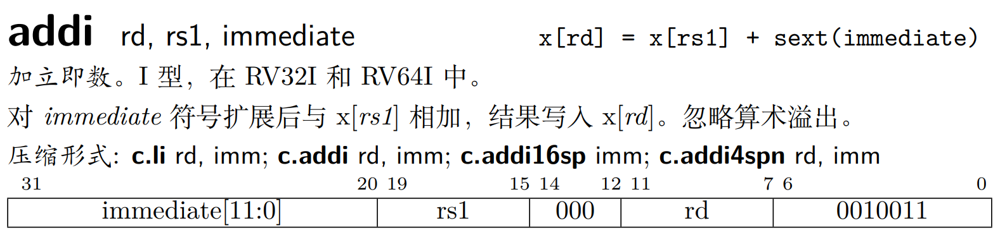
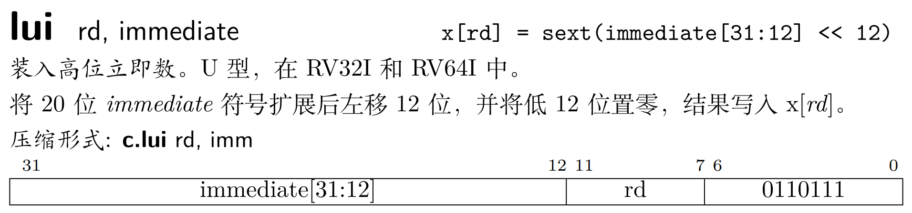
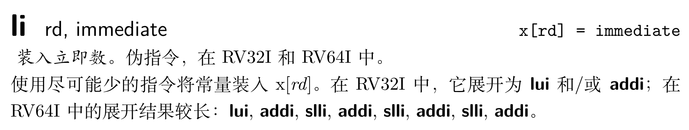
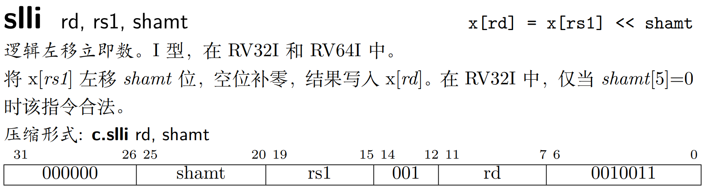

# Load Immediate

> 想要将一个立即数加载到寄存器中，可以使用伪指令li，但是li实际对应的指令是什么呢？汇编器是如何做的？

## addi lui li slli

* **addi：add immediate**



sext全称Sign EXTension；通过上图可以看到，立即数只有12位，那么如果我想处理的立即数不止12位怎么办？

* **lui：load upper immediate**



lui指令虽然有load，但是和访存一点关系也没有，其能够设置一个寄存器的高20位的值，与此同时，低12位的值被设置为0。

那么，如果想要将一个32位的立即数加载到寄存器中，就需要结合addi和lui了，即伪指令li。

* **li：load immediate**



li的具体展开由汇编器来实现，会根据立即数的位数来决定展开后的指令。

* **slli：shift left logical immediate**



shamt全称SHift AMounT，表示移位量，共6位，即最多移63位。故对于RV32而言，shamt[5]=0时才合法，否则目的寄存器为0。

## 例子

在RV32I中，假设想要将32位立即数0x12345678加载到寄存器x5中：

```asm
lui x5, 0x12345		# x5:0x12345000
addi x5, x5, 0x678	# x5:0x12345678
```

在RV64I中，假设想要将64位立即数0x123456789ABCDE0F加载到寄存器x5中：

```asm
lui x5, 0x12345		# x5:0x0000000012345000
addi x5, x5, 0x678	# x5:0x0000000012345678
slli x5, x5, 12		# x5:0x0000012345678000
addi x5, x5, 0x9AB	# x5:0x00000123456789AB
slli x5, x5, 12		# x5:0x00123456789AB000
addi x5, x5, 0xCDE	# x5:0x00123456789ABCDE
slli x5, x5, 8		# x5:0x123456789ABCDE00
addi x5, x5, 0x0F	# x5:0x123456789ABCDE0F
```

以上过程，均可以用li伪指令来替代，但**汇编器在解析li时做的事情不仅是简单的转换**，还需要**考虑立即数的实际情况**，比如考虑下面这种情况：

在RV32I中，假设想要将32位立即数0x12345FFF加载到寄存器x5中：

```asm
lui x5, 0x12345		# x5:0x12345000
addi x5, x5, 0xFFF	# x5:0x12344FFF
```

通过上面步骤得到的x5的值是0x12344FFF，因为addi在执行加法操作前，会将立即数sext为32位，故而如果只是将li做简单转换而不分析立即数的实际情况，会出现错误，正确做法：

```asm
lui x5, 0x12346		# x5:0x12345000
addi x5, x5, 0xFFF	# x5:0x12345FFF
```

li伪指令总结(RV32I)：

* 对于12位立即数：转换为addi；
* 对于32位立即数：转换为lui+addi；
  * 第12位为0：lui的立即数即为高20位；
  * 第12位为1：lui的立即数+1。
