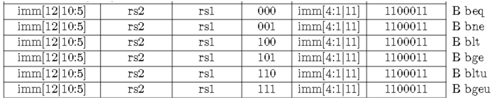
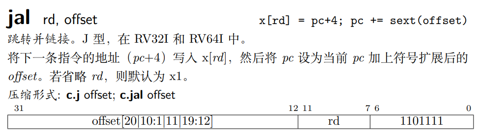
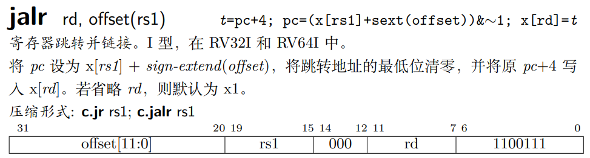

# B-type



我们注意到，B-type类型的指令中，imm是一个12位的立即数，在指令中只指出了imm的1到12位，第0位默认为0。

跳转的目标地址计算方法：根据B-type指令的机器码得到imm的第1-12位，将第0位添为0，而后加上当前PC值，即得到目标地址。

## 例子

这里有一个C语言程序：

```c
#include <stdio.h>
int main()
{
    int a = 3;
    if (a > 2)
    {
        a = 2;
    }
    else
    {
        a = 1;
    }
    return 0;
}
```

利用gcc和objdump来查看汇编代码，其中包含每条指令的地址以及机器码：

```shell
gcc -g -c btype.c -o btype.o
objdump -S byte.o
```

得到如下：

```asm
btype.o:     file format elf64-littleriscv


Disassembly of section .text:

0000000000000000 <main>:
#include <stdio.h>
int main()
{
   0:   1101                    add     sp,sp,-32
   2:   ec22                    sd      s0,24(sp)
   4:   1000                    add     s0,sp,32
    int a = 3;
   6:   478d                    li      a5,3
   8:   fef42623                sw      a5,-20(s0)
    if (a > 2)
   c:   fec42783                lw      a5,-20(s0)
  10:   0007871b                sext.w  a4,a5
  14:   4789                    li      a5,2
  16:   00e7d663                bge     a5,a4,22 <.L2>
    {
        a = 2;
  1a:   4789                    li      a5,2
  1c:   fef42623                sw      a5,-20(s0)
  20:   a021                    j       28 <.L3>

0000000000000022 <.L2>:
    }
    else
    {
        a = 1;
  22:   4785                    li      a5,1
  24:   fef42623                sw      a5,-20(s0)

0000000000000028 <.L3>:
    }
    return 0;
  28:   4781                    li      a5,0
  2a:   853e                    mv      a0,a5
  2c:   6462                    ld      s0,24(sp)
  2e:   6105                    add     sp,sp,32
  30:   8082                    ret
```

这里聚焦于bge指令，可以看到其机器码是00e7d663，该指令的地址是0x16，跳转的目标地址是0x22，那么我们看看是怎么计算得到目标跳转地址的：

* bge指令机器码：00e7d663 -> 0000 0000 1110 0111 1101 0110 0110 0011
* bge指令的格式：imm[12|10:5] rs2 rs1 101 imm[4:1|11] 1100011
* 对应结果：imm[12:1]=000000000110，rs2=01110，rs1=01111
* x14即a4，x15即a5；imm即0000 0000 0110 0，十进制为12；
* 当前PC值为0x16，加上imm，得到0x22，为跳转的目标地址。

所以说，对于B-type类型指令，跳转的目标地址即当前PC值(B-type指令的地址)加上imm的值(第0为填充为0)。

---

其实这对于J-type类型的指令也类似：



B-type是先比较，后跳转；J-type是先记录下一条指令的PC，再跳转。

二者跳转的部分类似，都会保证跳转偏移值第0位是0，且需要加上当前PC值。
